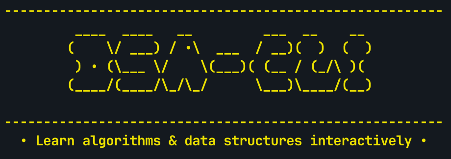

# DSA-CLI — Learn Data Structures and Algorithms Visually
<br>

Your friendly command-line companion for learning data structures and algorithms with **animations, code examples**, and **step-by-step explanations**.

<br>



<br>

## ❓ What is DSA-CLI?

**DSA-CLI is a simple terminal program that helps you understand sorting algorithms by:**

<br>

📊 **Showing animated visualizations** of how algorithms work

💻 **Displaying clean C code** implementations

📝 **Providing easy-to-read pseudocode**

⚙️ **Letting you customize** speed and appearance

<br>

 Perfect for CS students, self-learners, or anyone curious about how sorting and data structures work!

---
<br>

## 🐇 Quick Start
```
# Clone and build
git clone <repo-url> dsa-cli
cd dsa-cli
make

# Try it out!
./dsa bubble            # Watch bubble sort animation
./dsa selection --code  # See selection sort code
./dsa --help            # See all options
```

---
<br>

## 🧑‍💻 How to Use

#### Watch the sorting unfold

```
./dsa bubble      # Bubble sort animation
./dsa selection   # Selection sort animation  
./dsa insertion   # Insertion sort animation
```

#### See the Code
```
./dsa bubble --code      # Show C implementation
./dsa selection --pseudo # Show pseudocode steps
```

#### Customise your Experience
```
./dsa --speed 1     # Slow animation (good for learning)
./dsa --colors      # Toggle colors on/off
./dsa --bar '*'     # Use * instead of # for bars
```

#### Get Help
```
./dsa --help        # Show all commands
./dsa --settings    # Show current configuration
./dsa --tutorial    # Interactive tutorial
./dsa --list        # List available algorithms
```

---
<br>


## 🧮 Available Algorithms (for now)

| Algorithm      | Command               | Best for                       |
| -------------- | --------------------- | ------------------------------ |
| Bubble sort    | ```./dsa bubble```    | Understanding basic sorting    |
| Selection sort | ```./dsa selection``` | Learning how to find minimums  |
| Insertion sort | ```./dsa insertion``` | Seeing how sorted lists grow   |
| Merge sort     | ```./dsa merge```     | Understanding divide & conquer |


#### Each algorithm contains:

- Animated visualization (default)
- C code implementation (with ```--code```)
- Pseudocode explanation (with ```--pseudo```)
- eli5 explanation (with ```--eli5```)

---
<br>

## 🛠️ Settings & Configurations

DSA-CLI remembers your preferences! Settings are automatically saved to ```dsa_config.txt``` and loaded when you restart the program.

#### Speed control
```
# Animation Speed
./dsa --speed 1    # Slow (1.5 seconds per step) - great for learning
./dsa --speed 2    # Medium (0.8 second per step) - *balanced (default)*
./dsa --speed 3    # Fast (0.4 seconds per step) - quick demos
```

#### Visual Customization
```
# Colors (affects the animation bars)
./dsa --colors on     # Turn colors ON (red/green highlighting)
./dsa --colors off    # Turn colors OFF (plain text)
./dsa --colors        # Toggle between on/off

# Bar characters (customize the visualization)
./dsa --bar '#'    # Use # for bars (default)
./dsa --bar '*'    # Use * for bars
./dsa --bar '='    # Use = for bars
./dsa --bar '█'    # Use blocks for bars (fancy!)

```

#### Check your Settings
```
./dsa --settings   # Show current speed, colors, and bar character
cat dsa_config.txt # View the raw config file
```

#### Reset to Defaults
Restoring to Default requires deleting the ```dsa_config.txt```. No worries, a new one will be created upon opening the program.
```
rm dsa_config.txt  # Delete config file
./dsa --settings   # Will show defaults and recreate file when you change something
```

#### Example Workflow
```
# Set up your learning environment
./dsa --speed 1 --colors on --bar '█'

# Study algorithms with your preferences
./dsa bubble
./dsa selection

# Check what you have configured
./dsa --settings

# Your settings are automatically saved and will be remembered next time!
```

---
<br>

## 📂 Project Structure

```
dsa-cli/
├── main.c              # Command line parsing
├── config.c/.h         # Simple settings (speed, colors, etc.)
├── algorithms.c/.h     # Sorting implementations + animations
├── helpers.c/.h        # Display functions (bars, colors, etc.)
├── style.c/.h          # Color definitions
├── tutorial.c/.h       # Interactive tutorial
├── structures.c/.h     # Data structures (coming soon!)
└── Makefile            # Build instructions
```

**Total: ~500 lines of clean, well-commented C code** - perfect for learning from!

---
<br>

## ✏️ Learning Path

#### New to algorithms?
Try this order:

1. **Start here**: ```./dsa --tutorial```
2. **Bubble sort**: ```./dsa bubble``` (easiest to understand)
3. **Selection sort**: ```./dsa selection``` (slightly more efficient)
4. **Insertion sort**: ```./dsa insertion``` (good for small arrays)
5. **Merge sort**: ```./dsa merge --pseudo``` (divide and conquer!)


#### Learning loop

1. Watch the animation first
2. Look at the pseudocode: ```./dsa [algorithm] --pseudo```
3. Study the C code: ```./dsa [algorithm] --code```
4. Try different speeds to see details

#### Create your own algorithms

1. Add function prototypes to ```algorithms.h```
2. Implement animation, code, and pseudocode functions in ```algorithms.c```
3. Update the main parser in ```main.c```
4. Add to help text and lists

---
<br>

## 💾 Building & Installation

#### Requirements

- **macOS/Linux** *(Windows support coming soon!)*
- **GCC compiler**
- **Make utility**

#### Build
```
make           # Compile the program
make clean     # Remove compiled files  
make install   # Install to /usr/local/bin (optional)
```

---
<br>

## 🧑‍🔧 Troubleshooting

```
# If you get compiler errors:
gcc --version  # Make sure GCC is installed

# If colors don't work:
./dsa --colors off # Toggle them off

# If animation is too fast/slow:
./dsa --speed 1  # Try slow speed
```

---
<br>

---
<br>

## 📝 Examples

#### Learn Bubble Sort Step by Step

```
./dsa --speed 1 --colors on  # Set up for learning
./dsa bubble                 # Watch slow, colorful animation
./dsa bubble --pseudo        # Read the logic
./dsa bubble --code          # See implementation
./dsa --settings             # Check your current setup
```

#### Quick Demo for Friends *(or to impress your mum)*.

```
./dsa --speed 3 --bar '█'  # Fast with fancy bars
./dsa bubble               # Quick demo
```

#### Study Session Setup
```
./dsa --speed 1 --colors on  # Slow and clear
./dsa selection              # Watch selection sort
./dsa insertion              # Compare with insertion sort
# Settings are saved automatically!
```

#### Reset Everything
```
rm dsa_config.txt           # Delete saved settings
./dsa --speed 2 --colors on # Set new defaults
```

## 👷 Contributing

**Want to help make DSA-CLI better? Here are some ideas:**

#### Easy additions

- Add more algorithms (quicksort, heapsort)
- Improve the tutorial
- Add algorithm comparisons
- Create more visualization styles

#### Medium complexity:

- Implement data structures (stack, queue, tree)
- Add search algorithms (binary search, BFS, DFS)
- Performance timing comparisons

#### Advanced features:

- Interactive stepping through algorithms
- Algorithm complexity calculator
- Custom input arrays

#### Resources

- [`Command Line Interface Guidelines`](https://clig.dev/#foreword)
- [`ANSI.md by fnky`](https://gist.github.com/fnky/458719343aabd01cfb17a3a4f7296797)
- [`Markdown Guidelines`](https://www.markdownguide.org/basic-syntax/)
- [`Visualgo | visualising DSA`](https://visualgo.net/en)
- [`GNU Make Manual`](https://www.gnu.org/software/make/manual/make.html)

<br>

**Just fork the repo, submit a pull request and get cracking!**

---
<br>

## 📖 Educational Background

[TODO]: <> (ADD LINKS)

DSA-CLI implements standard algorithms taught in:

- CS50 (Harvard's intro computer science course)
- Introduction to Algorithms (CLRS textbook)
- The Algorithm Design Manual by Steven S. Skiena

<br>

Perfect for:

- Computer science students
- Self-taught programmers
- Teachers explaining algorithms
- Anyone curious about how sorting works!


---
<br>

## Fun Facts

🅲 Written in **pure C** - no external dependencies!

🖥️ **Cross-platform** - works on Mac, Linux, *(and soon Windows)*

🪶 **Lightweight** - entire program is under 1MB

🏎️ **Fast** - animations run smoothly even on older computers

📚 **Educational** - designed specifically for learning


---
<br>

## License

**Free and open source! Use it, modify it, share it, teach with it.**

---
<br>

## Happy Learning!

#### *Master algorithms one visualization at a time.*

#### 🔗 Quick Links

[TODO]: <> (ADD LINKS)

🐛 Report a Bug

💡 Request a Feature

📖 CS Learning Resources

💬 Questions? Open an issue or discussion!# dsa-cli
